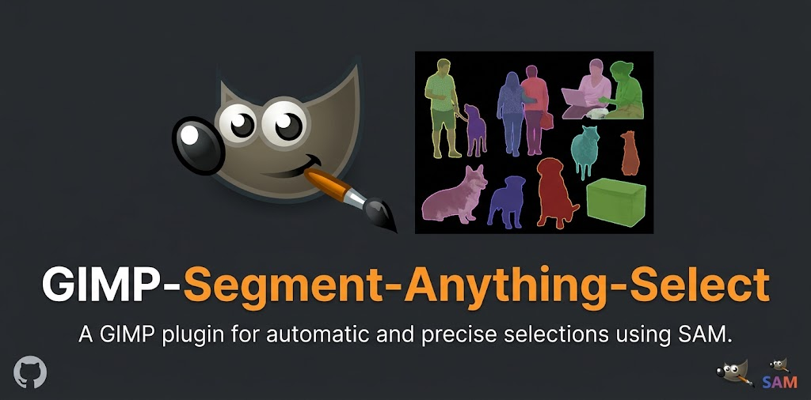
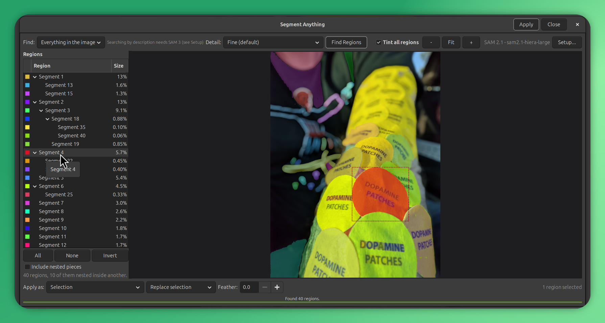
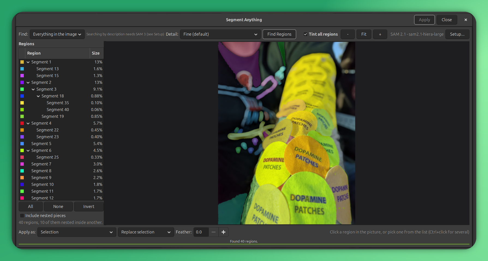
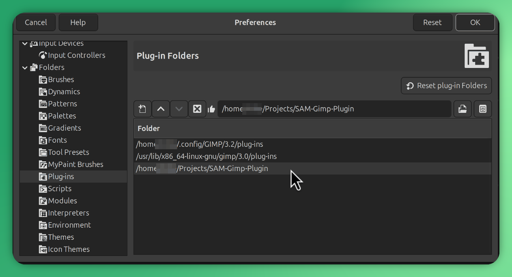
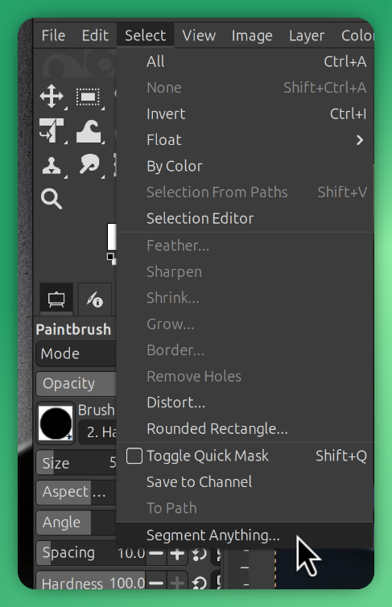
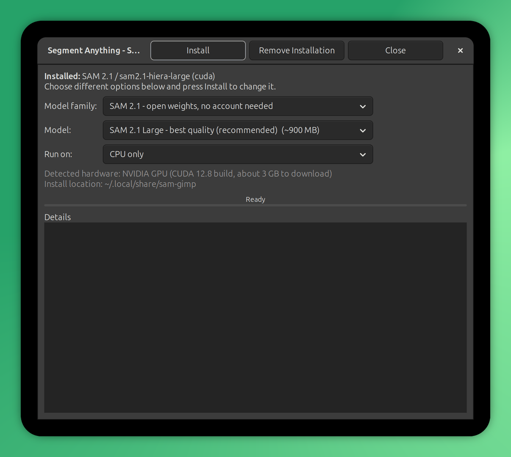
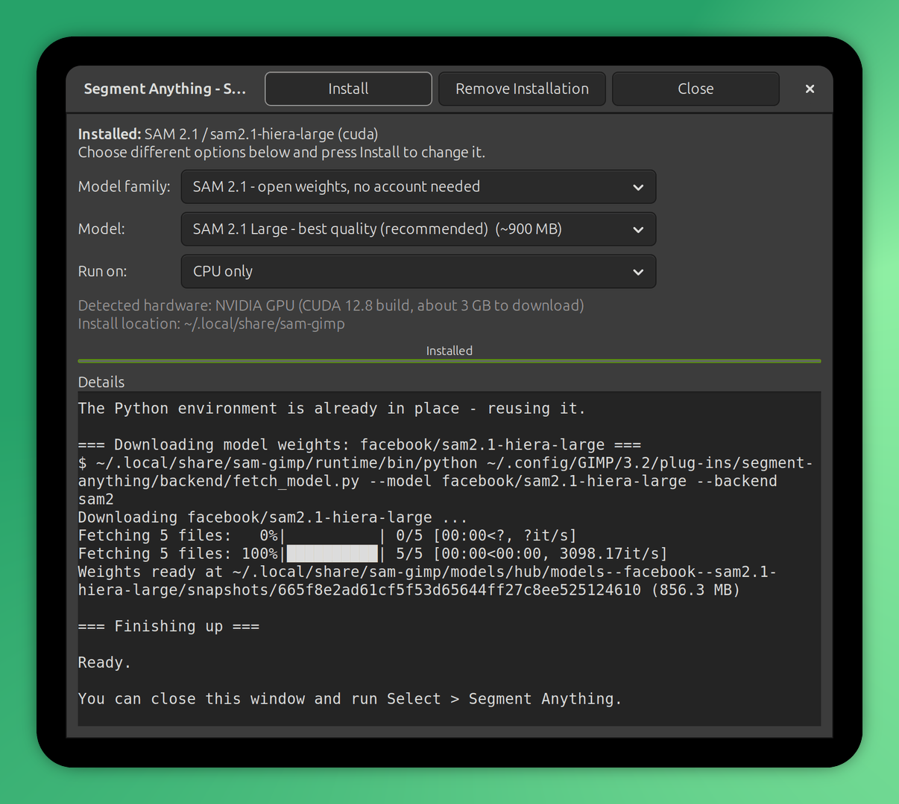

<p align="center">
  
</p>

# GIMP Segment Anything Select

Click on things to select them. This plug-in runs Meta's Segment Anything
models over the current image, lists every region it finds, and turns whichever
ones you pick into a selection, a layer mask, a new layer or a channel.

**SAM 3 is supported**, as well as SAM 2.1. SAM 3 adds description prompts: type
`wheel` and every wheel in the picture comes back as its own named region,
the ones in the background included. Nothing to configure and no Python to
install first, the plug-in fetches its own runtime on first use.



*One region picked by clicking it. The list on the left and the picture on the
right are two views of the same choice, and the tree shows how the smaller
pieces nest inside the larger ones. Ctrl+click adds more, or Command+click on
macOS; the plug-in follows whatever your system uses.*

## What you get

Two ways to choose what you want, kept in step with each other:



*Straight after **Find Regions**: 40 regions on this photo, 10 of them nested
inside another. Nothing is selected yet.*

**The list on the left** holds every region, each with a colour chip matching
its overlay. A region found inside another one is filed underneath it, so a car
keeps its wheels, windows and door handles together. Ctrl+click and Shift+click
behave as they do anywhere else, and there are All / None / Invert buttons.

**The picture on the right** shows those same regions shaded on the image.
Click one to select it. Hold Ctrl (Command on macOS) while clicking to gather
several. Clicking a part that sits inside a larger object gives you the part,
not the whole object.

With SAM 3 there is a third way in: switch **Find** to *Find by description*,
type a short phrase, and you get one named region per match rather than a numbered
list to hunt through.

Your choice then becomes whichever of these you asked for:

| Output | Result |
| --- | --- |
| Selection | An ordinary GIMP selection: replace, add, subtract or intersect, with optional feathering |
| Layer mask | A mask on the active layer |
| New layer | A copy of the layer with everything outside the regions cut away |
| Channel | A stored channel you can load again later |

It all lands as a single undo step.

## Requirements

GIMP 3.0 or newer, on 64-bit Windows, macOS or Linux. GIMP 3.2 is what I test
against. GIMP 2.10 will not work, since it runs Python 2 and a different
plug-in API.

Budget roughly 8 GB of disk for the runtime plus one model.

A GPU is optional. NVIDIA cards and Apple Silicon are picked up automatically;
failing that it falls back to the processor, which works but is slow.

You do not need Python, PyTorch, conda or a compiler on your system. The
plug-in fetches its own private copy of all of that.

## Installing

On the GitHub page, choose **Code > Download ZIP**, and open the archive. Inside
it, go to `plug-ins/` and copy the whole **`segment-anything`** folder into your
GIMP plug-ins directory:

| | |
| --- | --- |
| Linux | `~/.config/GIMP/3.0/plug-ins/` |
| macOS | `~/Library/Application Support/GIMP/3.0/plug-ins/` |
| Windows | `%APPDATA%\GIMP\3.0\plug-ins\` |

Use whichever version number your GIMP reports; 3.2 keeps its own folder. GIMP
prints the exact path under *Edit > Preferences > Folders > Plug-ins*, and you
can add a folder of your own choosing there too:



Restart GIMP. That is the whole installation: nothing to build and nothing to
run.

You should end up with `.../plug-ins/segment-anything/segment-anything.py`, with
`samgimp` and `backend` folders beside it. If you see a nested
`segment-anything/segment-anything/`, you copied one level too high.

On Linux and macOS the file `segment-anything.py` has to stay executable. Every
normal unzip tool keeps it that way, but if the menu entry never appears, that
is the first thing to check:

```
chmod +x segment-anything.py
```

Each tagged [release](https://github.com/a904guy/GIMP-Segment-Anything-Select/releases)
also carries a `gimp-segment-anything-select-<version>.zip` holding just that one
folder, trimmed of the tests and documentation, with a SHA-256 checksum beside
it. Either download installs the same plug-in.

<details>
<summary>Installing from a clone instead</summary>

If you already have the repository, `install.py` finds your GIMP profiles and
copies the plug-in into each of them:

```
python3 install.py            # py install.py on Windows
python3 install.py --list     # show what it found, change nothing
python3 install.py --dir PATH # install somewhere specific
python3 install.py --uninstall
```

Releases are built by GitHub Actions, not locally: tagging a commit `v1.2.3`
runs the tests, assembles the zip, checks it is still installable and attaches
it to the release.

</details>

### The first run

Open an image and pick **Select > Segment Anything...**



You will be offered a one-time setup. It pulls down a private Python
environment, PyTorch and the model weights, somewhere between 1 and 4 GB
depending on which model you chose, and prints a running log so you can watch
what it is doing. Later runs skip straight to work.



Pressing Install shows each step as it happens, so a long download never looks
like a hung dialog:



To change your mind later, use the **Setup...** button in the window, or
**Filters > Segment Anything > Setup...**

## Picking a model

| | SAM 2.1 (default) | SAM 3 |
| --- | --- | --- |
| Account needed | No | Yes, a free Hugging Face account |
| Download | 150 MB to 900 MB | About 3.5 GB |
| Segment everything | Yes | Yes |
| Find by description | No | Yes. Type `red car`, get every red car as its own region |
| Licence | Apache 2.0 | Meta's SAM Licence |

SAM 2.1 is the safe default, with open weights and no account to create. It
comes in four sizes. Large draws the best boundaries; Tiny is the quickest.

SAM 3 adds an understanding of short noun phrases: ask for `wheel` and you get
each wheel as its own named region, background ones included. Its weights are
gated, so before you can install it you need to:

1. Sign in at <https://huggingface.co/facebook/sam3> and accept the licence.
2. Create an access token at <https://huggingface.co/settings/tokens>.
3. Paste that token into the Setup window.

Approval is granted by Meta and is not instant. The token is kept in
`settings.json` inside the plug-in's data folder, in plain text, so treat that
folder as you would any other credential store. Changing models afterwards only
downloads the new weights, because the Python environment gets reused.

SAM 3 is the hungrier of the two. Its two modes are served by separate
multi-gigabyte heads, and only the one in use is held in memory: switching
between "everything" and "find by description" releases the other. Even so,
searching by description wants roughly 3 GB of free video memory and segmenting
everything wants closer to 6 GB. If something else on the machine is holding the
card, a language model server for instance, expect an out-of-memory message and
either free it up or fall back to SAM 2.1.

## Using it

| What you want | How |
| --- | --- |
| One region | Click it on the image, or click its row in the list |
| Several regions | Ctrl+click each one, on the image or in the list. Command+click on macOS |
| A run of rows | Shift+click in the list |
| An object plus its parts | Tick **Include nested pieces**, then click the object |
| A sense of what is there | **Tint all regions** shades everything. Switch it off to see the photo underneath |
| Zoom | Ctrl+scroll (Command+scroll on macOS), or the `-` / `Fit` / `+` buttons |
| Pan | Drag with the middle mouse button, or hold Alt/Option and drag |
| More, smaller regions | Raise **Detail**, then press **Find Regions** again |
| Search by name (SAM 3) | Set **Find** to *Find by description*, type a phrase, press Enter |

**Detail** controls how densely the model gets probed with points. Turn it up to
catch smaller parts, at the cost of time. Regions below 0.05% of the image get
dropped, and near-identical ones are merged.

## Platform notes

Linux, macOS and Windows are all supported, with a few differences worth
knowing about.

**macOS.** The multi-select modifier is Command, not Control, because Control
plus click is the system secondary-click gesture. The plug-in asks the toolkit
which modifier to use rather than assuming, so it matches whatever your system
does. Apple Silicon gets the Metal build of PyTorch. If GIMP happens to be
running under Rosetta, that is detected and an Apple Silicon runtime is built
anyway, rather than an Intel one that would lose GPU acceleration.

**Windows.** PyTorch's CUDA files nest deeply enough to run past the old
260-character path limit. The installer checks whether long path support is
enabled and warns you if not; to turn it on, set
`HKLM\SYSTEM\CurrentControlSet\Control\FileSystem\LongPathsEnabled` to 1
and reboot, or install to a short path with `SAM_GIMP_HOME`. The helper process
listens only on 127.0.0.1, which normally avoids a firewall prompt.

**Linux.** glibc and musl systems both work; the right build is chosen for you.
Flatpak and Snap builds of GIMP run inside a sandbox that may not be able to
launch the private runtime. If you use one of those and setup fails, a
distribution or AppImage build of GIMP is the simpler path.

**AMD GPUs** are not detected, on any system. ROCm is untested here, so the
installer falls back to the processor build rather than guessing.

## Speed

On an RTX 4090 with SAM 2.1 Large, against an 1800x1200 photo:

| | Time |
| --- | --- |
| First run, including loading the model | about 5.5 s |
| Runs after that, model still warm | about 2 s |

A small helper process keeps the model in memory and shuts itself down after 15
idle minutes, which is where that difference comes from. Big images get
segmented at a reduced working size and the masks are scaled back up, so what
you apply is always at full resolution.

## Where the files live, and getting rid of them

Everything downloaded sits in one folder, well away from the plug-in itself:

| | |
| --- | --- |
| Linux | `~/.local/share/sam-gimp` |
| macOS | `~/Library/Application Support/sam-gimp` |
| Windows | `%LOCALAPPDATA%\SamGimp` |

Set `SAM_GIMP_HOME` before starting GIMP to put that folder somewhere else,
which is useful on a small system drive or to keep paths short on Windows.

To drop the models and runtime, use **Remove Installation** in the Setup window,
or just delete that folder. To drop the plug-in, run
`python3 install.py --uninstall`.

Nothing gets written outside those two places.

## When something goes wrong

**No menu item.** Restart GIMP. Confirm that *Edit > Preferences > Folders >
Plug-ins* lists the folder you installed into, and on macOS or Linux that
`segment-anything.py` is still executable.

**"The backend did not start."** Read `logs/backend.log` inside the data folder
listed above. Usually this means an install got interrupted, so run Setup again.

**"CUDA out of memory."** Drop to a smaller model, lower **Detail**, or shrink
the working size in Setup. Quitting other GPU-hungry applications also frees
room.

**SAM 3 refuses to download.** Its weights are gated. Accept the licence on the
model page and paste in a token, as above. A token you made before accepting the
licence is still fine.

**Everything is slow.** Open Setup. If it reports *CPU only*, no supported GPU
was found. On a processor, SAM 2.1 Tiny beats Large by a wide margin.

**No regions found.** Raise **Detail**, or lower the minimum region size. Very
flat or very noisy images give the model little to grip.

## How it is put together

You cannot install PyTorch into GIMP's bundled Python. Its version is dictated
by whoever built GIMP, and every other plug-in shares it. So the code is split
in two:

```
GIMP  -->  segment-anything.py            GIMP's Python: GTK dialogs only
             samgimp/...                   standard library plus GObject
                  |
                  |  JSON over a loopback socket (random port, shared token)
                  v
           backend/sam_server.py          its own Python 3.12, PyTorch,
             backend/adapters/...         transformers, model weights
```

The helper process owns the model and outlives any single invocation. Masks
come back as run-length data, a few kilobytes rather than megabytes, and get
expanded with slice assignment, which stays fast without numpy. Click targeting
reads a one-byte-per-pixel label map, so working out which region you hit is one
array lookup however many regions exist.

The private environment is built with `uv`, downloading a copy of `uv` first if
your system has none. PyTorch is matched to your hardware: the CUDA 12.8 build,
Apple Metal, or processor-only.

## Working on the code

```
python3 tests/run.py           # no GPU or weights needed, uses a stub segmenter
python3 tests/run.py --gimp    # adds the tests that run inside gimp-console
python3 tests/run.py --render /tmp/panes.png   # save a picture of the two panes
```

Layout:

```
plug-ins/segment-anything/
  segment-anything.py     GIMP registration and entry points
  samgimp/                dialogs, canvas, region list, GIMP I/O, installer
  backend/                helper process: server, mask maths, model adapters
install.py                copies the plug-in into your GIMP profiles
tests/                    test suite
.github/workflows/        the release build
```

There is no local build step. `plug-ins/segment-anything` is what gets
installed, however it is obtained, so it is kept directly installable and the
tests check that it stays so.

To support another model, add a file under `backend/adapters/` that can load it
and hand back masks. `adapters/base.py` shows what the interface expects.

## Licences and credits

This plug-in is GPL-3.0-or-later, matching GIMP. See `LICENSE`.

SAM 2 and SAM 2.1 come from Meta AI under Apache 2.0
(<https://github.com/facebookresearch/sam2>). SAM 3 also comes from Meta AI,
under the gated SAM Licence (<https://github.com/facebookresearch/sam3>). Both
are loaded through Hugging Face Transformers, which is Apache 2.0.

Weights are downloaded from Hugging Face during setup and are not redistributed
here. Meta's licences govern what you may do with the models, commercial use
included.

